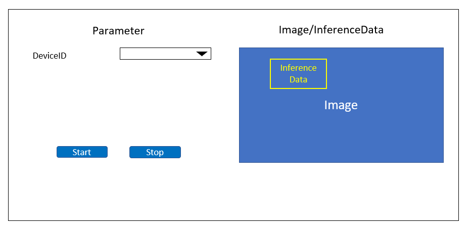

= Cloud SDK pass:[ ] Sample Application pass:[ ] TypeScript pass:[ ] Functional Specifications pass:[ ]
:sectnums:
:sectnumlevels: 1
:author: Copyright 2023 Sony Semiconductor Solutions Corporation
:version-label: Version 
:revnumber: x.x.x
:revdate: YYYY - MM - DD
:trademark-desc1: AITRIOS™ and AITRIOS logos are the registered trademarks or trademarks
:trademark-desc2: of Sony Group Corporation or its affiliated companies.
:toc:
:toc-title: TOC
:toclevels: 1
:chapter-label:
:lang: en

== Change history

|===
|Date |What/Why

|2022/12/12
|Initial draft

|2023/1/30
|Unified the swinging of expressions + 
Fixed the notation + 
Updated the PDF build environment

|2023/5/26
|Fixed parenthesis notation for tool names + 
Added alternate text to images

|===

== Introduction

* This book is functional specifications for a sample application that provides developers with ways to use and take advantage of the "**Cloud SDK**" for TypeScript. + 
** TypeScript is used as the function development language.
** The application framework uses Next.js.

== Terms/Abbreviations
|===
|Terms/Abbreviations |Meaning

|"**Cloud SDK**"
|SDK providing a way to access the "**Console**"

|"**Console**"
|A cloud service that provides various functions (Deployment, Retraining, Edge AI Device Management etc.) to efficiently implement solutions from edge to cloud

|Inference result
|AI-processed metadata among outputs from "**Vision and Sensing Applications**"

|Image
|Image data captured by edge AI devices among outputs from "**Vision and Sensing Applications**"

|===

== Reference materials
* "**Cloud SDK**" for TypeScript used in sample applications
** https://github.com/SonySemiconductorSolutions/aitrios-sdk-console-access-lib-ts

== Expected use case
* Provide ways to use and take advantage of the "**Cloud SDK**" for TypeScript.
** Users can see how applications using the "**Cloud SDK**" work by launching applications in the repository.
** Users can see how to use the "**Cloud SDK**" by reviewing the source code.

== Functional overview/Algorithm
[NOTE]
=== Functional overview
* Users can see the latest image and inference results on the screen.
** The base AI model only supports Object Detection.
* The Start/Stop button will appear by selecting the DeviceID.
* By pressing the START button, the latest image/inference results is gotten and displayed on the screen.
* By pressing the STOP button, getting the latest image/inference result is stopped.

=== Algorithm
. Launch the screen.
.. Call the getDeviceData.
.. Display the returned data in the DeviceID selection field.
.  DeviceID is entered, the START button is pressed.
.. Call the getCommandParameterFile to check that the settings are as follows. (Display a message if there is an error.)
** Mode=1(Image&Inference Result)
** UploadMethodIR="Mqtt"
.. Call the startUpload to start upload of inference results and images.
.. Call getImageAndInference periodically to get inference results and images.
.. Display the gotten data on the screen.
. Press the STOP button.
.. Call the stopUpload.

=== Under what condition
* Have access to the "**Console**".
* A TypeScript development environment has been built.
** A Codespaces environment is also available.
** TypeScript version is 4.7.
* An edge AI device is connected to the "**Console**" and ready to accept operations from the "**Console**".

=== API
* GET
** {baseUrl}/getDeviceData
** {baseUrl}/getCommandParameterFile/deviceId
** {baseUrl}/getImageAndInference/deviceId/subDirectoryName
* POST
** {baseUrl}/startUpload/deviceId
** {baseUrl}/stopUpload/deviceId

=== Others exclusive conditions/Specifications
* None

== User interface specifications
=== Screen specifications

=== Operability Specifications
==== Operation to launch the sample application
==== When to use Codespaces
. Developers open the repository of the sample application from any browser and launch Codespaces.
. Build containers in the cloud with reference to configuration files that exist in repositories.
. Use the built container in the browser or from VS Code.
. Launch the sample application.

==== When not to use Codespaces
. Developers open the repository of the sample application from any browser and clone the repository.
. Install the necessary packages for the cloned sample application.
. Launch the sample application.

==== After starting the sample application
. Select the [**DeviceID**].
. By pressing the [**START**] button, the latest image/inference results is gotten and displayed on the screen.
. By pressing the [**STOP**] button, getting the latest image/inference result is stopped.

== API parameters in each block
=== GET

* {baseUrl}/getDeviceData
**  Get and return the list of DeviceIDs.
|===
|Query Parameter’s name|Meaning|Range of parameter

|- |- |-

|===
|===
|Return value|Meaning

|deviceData
|Object where DeviceIDs are stored
|===

* {baseUrl}/getCommandParameterFile/deviceId
** Get the list of Command Parameter Files registered in the "**Console**" and return the settings.
|===
|Query Parameter’s name|Meaning|Range of parameter

|deviceId |DeviceID uploading images and inference results |Not specified

|===
|===
|Return value|Meaning

|mode
|Mode settings registered in the "**Console**"

|uploadMethodIR
|UploadMethodIR settings registered in the "**Console**"
|===

* {baseUrl}/getImageAndInference/deviceId/subDirectoryName
** Get and return inference results and images for the specified edge AI device.
|===
|Query Parameter’s name|Meaning|Range of parameter

|deviceId |DeviceID uploading images and inference results |Not specified

|subDirectoryName |Path where images are stored |Not specified

|===
|===
|Return value|Meaning

|imageAndInference
|Object where image paths and inference results are stored
|===

=== POST
* {baseUrl}/startUpload/deviceId
** Request to start uploading inference results and images for the specified DeviceID.
|===
|Body Parameter’s name|Meaning|Range of parameter

|deviceId |DeviceID to start uploading images and inference results |Not specified

|===
|===
|Return value|Meaning

|result
|SUCCESS or ERROR string

|outputSubDirectory
|Input image storage path

|===

* {baseUrl}/stopUpload/deviceId
** Request to stop uploading inference results and images for the specified DeviceID.
|===
|Body Parameter’s name|Meaning|Range of parameter

|deviceId |DeviceID to stop uploading images and inference results |Not specified

|===
|===
|Return value|Meaning

|result
|SUCCESS or ERROR string
|===

== Target performances/Impact on performances
* None

== Assumption/Restriction
* From the "**Console**" UI, set the Command Parameter File to the following setting:
** Mode=1(Image&Inference Result)
** UploadMethodIR="Mqtt"
** Other parameters need to be changed depending on the AI model and application content
* Object detection is deployed as the base AI model.
* If you select an edge AI device that does not have an AI model or application deployed at runtime, it will not work properly.

== Remarks
* Image uploads from edge AI devices to the cloud can experience delays of up to several minutes.

== Unconfirmed items
* None
