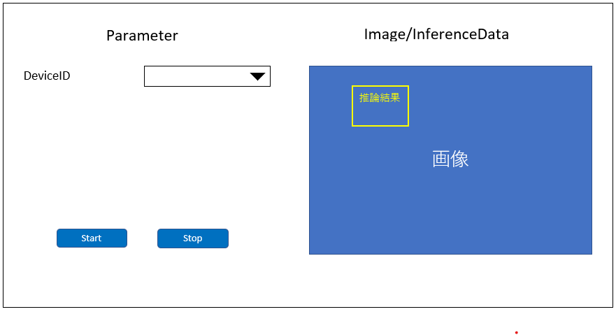

= Cloud SDK pass:[ ] サンプルアプリケーション pass:[ ] TypeScript版 pass:[ ] 機能仕様書 pass:[ ]
:sectnums:
:sectnumlevels: 1
:author: Copyright 2023 Sony Semiconductor Solutions Corporation
:version-label: Version 
:revnumber: x.x.x
:revdate: YYYY - MM - DD
:trademark-desc: AITRIOS™、およびそのロゴは、ソニーグループ株式会社またはその関連会社の登録商標または商標です。
:toc:
:toc-title: 目次
:toclevels: 1
:chapter-label:
:lang: ja
:imagesdir: ./images/

== 更新履歴

|===
|Date |What/Why

|2022/12/12
|初版作成

|2023/01/30
|表現統一 + 
記法修正 + 
PDFビルド環境更新

|2023/05/26
|ツール名の括弧の表記の修正 + 
図の代替テキスト追加

|2023/12/22
|Console Developer Edition対応

|2024/03/25
|AWS対応

|===

== はじめに

* 本書は、TypeScript版「**Cloud SDK**」の利用方法や活用方法を開発者に提供するサンプルアプリケーションについての機能仕様である。
** 機能開発言語には、TypeScriptを使用する。
** アプリケーションフレームワークはNext.jsを使用する。

== 用語・略語
|===
|Terms/Abbreviations |Meaning

|「**Cloud SDK**」
|「**Console**」へのアクセス方法を提供するSDK

|「**Console**」
|エッジからクラウドを含めたソリューションを効率的に導入するための各種機能（デプロイメント機能、リトレーニング機能、エッジデバイスマネジメント機能など）を提供するクラウドサービス

|推論結果
|「**Edge Application**」からの出力のうち、AI処理されたメタデータ

|画像
|「**Edge Application**」からの出力のうち、エッジデバイスがとらえているイメージデータ

|Azure Blob Storage
|Microsoft社が提供するオブジェクトストレージ

|Amazon S3
|Amazonが提供するオブジェクトストレージ

|Local Storage
|ユーザーがサンプルアプリケーションを動作させるデバイスのストレージ

|Local HTTP Server
|エッジデバイスが出力するデータをLocal Storageに保存する際に起動するサーバー

|===

== 参照資料
* サンプルアプリケーションで利用するTypeScript版「**Cloud SDK**」
** https://github.com/SonySemiconductorSolutions/aitrios-sdk-console-access-lib-ts

== 想定ユースケース
* TypeScript版「**Cloud SDK**」の利用方法や活用方法を提供できる。
** ユーザーはリポジトリ内のアプリケーションを起動することで、「**Cloud SDK**」を利用したアプリケーションの動作を確認できる。
** ユーザーはリポジトリ内のアプリケーションを起動することで、「**Console**」、Azure Blob Storage、Amazon S3、Local Storageのいずれかにアップロードされたデータを確認できる。
** ユーザーはソースコードを確認することで、「**Cloud SDK**」の利用方法を確認できる。

== 機能概要、アルゴリズム
[NOTE]
=== Functional Overview
* 最新画像と最新の推論結果を画面上で確認できる。
** AIモデルはObject Detectionのみ対応する。
* DeviceIDを選択することで、Start/Stopボタンが表示される。
* STARTボタンを押下することで、最新画像/最新推論結果を取得し画面に表示する。
* STOPボタンを押下することで、最新画像/最新推論結果の取得を停止する。

=== Algorithm
. src/common/settings.tsの「CONNECTION_DESTINATION」に接続先を記載する。
* CONNECTION_DESTINATIONは下記の値を設定可能。
** SERVICE.Console
** SERVICE.Azure
** SERVICE.AWS
** SERVICE.Local
. 画面を起動する。
.. getDeviceDataが呼び出される。
.. 返却されたデータをDeviceID選択欄に表示する。
.  DeviceIDを入力し、STARTボタンを押下する。
.. getCommandParameterFileが呼び出され、設定値が下記の通りであることをチェックする。（Errorの場合はメッセージ表示する。）
** Mode=1(Image&Inference Result)
.. startUploadが呼び出され、推論結果と画像のアップロードが開始される。
.. getImageAndInferenceが定期呼び出しされ、推論結果と画像を取得する。
* データの取得先は、利用するクラウドサービスやSDKを判断する抽象化層がsrc/common下の接続情報やsrc/common/settings.tsのCONNECTION_DESTINATIONの設定値を元に判別する。
... CONNECTION_DESTINATIONに「SERVICE.Console」を指定した場合は、「**Console**」からデータを取得する。
... CONNECTION_DESTINATIONに「SERVICE.Azure」を指定した場合は、Azure Blob Storageからデータを取得する。
... CONNECTION_DESTINATIONに「SERVICE.AWS」を指定した場合は、Amazon S3からデータを取得する。
... CONNECTION_DESTINATIONに「SERVICE.Local」を指定した場合は、Local Storageからデータを取得する。
* 接続情報や接続先指定に誤りがある場合は、データ取得時にエラーが表示される。
.. 取得したデータは画面に表示される。
. STOPボタンを押下する。
.. stopUploadが呼び出される。
.. Local HTTP Serverが保存したデータのファイル構成を、deviceIDとsubDirectoryを利用して変更する。 + 
変更後のファイル構成は制限事項を参照とする。

=== Under what condition
* 「**Console**」へのアクセスができること。
* 「**Console**」やクラウドサービスを利用する場合は、それぞれの接続情報が用意されていること。
** 「**Console**」を利用する場合はsrc/commonに console_access_settings.yaml があり、必要な接続情報が設定されていること。
** 「**Console**」以外のクラウドサービスを利用する場合はsrc/commonに [サービス名小文字]_access_settings.yaml があり、必要な接続情報が設定されていること。
*** 例

   azure_access_settings.yaml

** Localストレージを使用する場合はsrc/common/settings.tsの「LOCAL_ROOT」に参照するディレクトリのルートが記載されていること。
*** 例

   export const LOCAL_ROOT = 'C:\\any_place\\...'

*** LOCAL_ROOTに設定する値は絶対パスのみ設定可能とする。
* TypeScriptの開発環境が構築されていること。
** Codespaces環境も利用可能。
** TypeScriptのversionは4.7。
* エッジデバイスが「**Console**」に接続されており、「**Console**」からの操作を受けつける状態である。

=== API
* GET
** {baseUrl}/getDeviceData
** {baseUrl}/getCommandParameterFile/deviceId
** {baseUrl}/getImageAndInference/deviceId/subDirectoryName
* POST
** {baseUrl}/startUpload/deviceId
** {baseUrl}/stopUpload/deviceId

=== Others Exclusive conditions / specifications
* なし

== 操作性仕様、画面仕様
=== 画面仕様

=== 操作性仕様
==== サンプルアプリケーション起動までの操作
==== Codespaces利用時
. 開発者は任意のブラウザからサンプルアプリケーションのリポジトリを開きCodespacesを起動する。
. クラウドでリポジトリ内に存在する設定ファイルを参考にコンテナを構築する。
. 構築されたコンテナをブラウザ上またはVS Codeから利用する。
. src/commonに接続情報が記載されている設定ファイルを配置する。
. src/common/settings.tsの「CONNECTION_DESTINATION」に接続先を記載する。
** 「CONNECTION_DESTINATION」には下記の値を設定可能。
+
|===
|設定値|データ取得先

|SERVICE.Console|「**Console**」
|SERVICE.Azure|Azure Blob Storage
|SERVICE.AWS|Amazon S3
|SERVICE.Local|src/common/settings.tsの「LOCAL_ROOT」に設定されたパス
|===
. サンプルアプリケーションを起動する。

==== Codespacesを利用しない場合
. 開発者は任意のブラウザからサンプルアプリケーションのリポジトリを開き、リポジトリをCloneする。
. Cloneしたサンプルアプリケーションに必要なパッケージをインストールする。
. src/commonに接続情報が記載されている設定ファイルを配置する。
. src/common/settings.tsの「CONNECTION_DESTINATION」に接続先を記載する。
** 「CONNECTION_DESTINATION」には下記の値を設定可能。
+
|===
|設定値|データ取得先

|SERVICE.Console|「**Console**」
|SERVICE.Azure|Azure Blob Storage
|SERVICE.AWS|Amazon S3
|SERVICE.Local|src/common/settings.tsの「LOCAL_ROOT」に設定されたパス
|===
. サンプルアプリケーションを起動する。

==== サンプルアプリケーション起動後の操作
. [**DeviceID**]を選択する。
. [**START**]ボタンを押下することで、最新の画像/推論結果の取得を開始し、画面上に表示される。
** 接続情報や接続先指定に誤りがある場合は、データ取得時にエラーが表示される。
. [**STOP**]ボタンを押下することで、最新の画像/推論結果の取得が停止する。

== APIパラメータ
=== GET

* {baseUrl}/getDeviceData
**  DeviceIDのリストを取得し返却する。
|===
|Query Parameter’s name|Meaning|Range of parameter

|-
|-
|-

|===
|===
|Return value|Meaning

|deviceData
|DeviceIDが格納されたオブジェクト
|===

* {baseUrl}/getCommandParameterFile/deviceId
** 「**Console**」に登録されたCommand Parameter Fileの一覧取得し、設定値を返却する。
|===
|Query Parameter’s name|Meaning|Range of parameter

|deviceId
|画像と推論結果をUploadしているDeviceID
|指定なし

|===
|===
|Return value|Meaning

|mode
|「**Console**」に登録されているModeの設定値

|uploadMethodIR
|「**Console**」に登録されているUploadMethodIRの設定値
|===

* {baseUrl}/getImageAndInference/deviceId/subDirectoryName
** 指定したエッジデバイスの推論結果と画像を取得し返却する。
|===
|Query Parameter’s name|Meaning|Range of parameter

|deviceId
|画像と推論結果をUploadしているDeviceID
|指定なし

|subDirectoryName
|画像が格納されるパス
|指定なし

|===
|===
|Return value|Meaning

|imageAndInference
|画像パスと推論結果が格納されたオブジェクト
|===

=== POST
* {baseUrl}/startUpload/deviceId
** 指定したDeviceIDに対して推論結果と画像のUpload開始を要求する。
|===
|Body Parameter’s name|Meaning|Range of parameter

|deviceId
|画像と推論結果をUploadさせるDeviceID
|指定なし

|===
|===
|Return value|Meaning

|result
|SUCCESSかERRORの文字列

|outputSubDirectory
|Input Image格納パス

|===

* {baseUrl}/stopUpload/deviceId
** 指定したDeviceIDに対して推論結果と画像のUpload停止を要求する。
** 接続先がLocalの場合はLocal Storageのファイル構成を修正する。
|===
|Body Parameter’s name|Meaning|Range of parameter

|deviceId
|画像と推論結果のUploadを停止させるDeviceID
|指定なし

|subDirectory
|画像や推論結果が格納されるパス
|指定なし

|===
|===
|Return value|Meaning

|result
|SUCCESSかERRORの文字列
|===

== 目標性能
* なし

== 制限事項
* 「**Console**」のUIから、Command Parameter Fileを下記の設定にする。(2023/12/04時点)
** Mode=1(Image&Inference Result)
** FileFormat="JPG"
** NumberOfInferencesPerMessage=1
** AIモデルやアプリケーションの内容に応じて、その他のパラメータも変更する必要がある。
* AIモデルは、Object Detectionのみ対応
* Local HTTP ServerがLocal Storageにデータを保存する際のファイル構成は下記とする。
   
   image
   meta
   Device ID
      ∟image
         ∟yyyyMMddHHmmssfff (1)
            ∟yyyyMMddHHmmssfff.jpg (2)
            ∟yyyyMMddHHmmssfff.jpg (2)
      ∟meta
         ∟yyyyMMddHHmmssfff (1)
            ∟yyyyMMddHHmmssfff.txt (3)
            ∟yyyyMMddHHmmssfff.txt (3)

   (1) 推論開始時刻​
   (2) 推論元画像ファイル(ファイル名は、推論元画像出力時刻)
   (3) 推論結果ファイル(ファイル名は、推論結果出力時刻)

* Azure Blob Storage/Amazon S3利用時のデータファイル構成は下記とする。

   Device ID
      ∟image
         ∟yyyyMMddHHmmssfff (1)
            ∟yyyyMMddHHmmssfff.jpg (2)
            ∟yyyyMMddHHmmssfff.jpg (2)
      ∟metadata
         ∟yyyyMMddHHmmssfff (1)
            ∟yyyyMMddHHmmssfff.txt (3)
            ∟yyyyMMddHHmmssfff.txt (3)

   (1) 推論開始時刻​
   (2) 推論元画像ファイル(ファイル名は、推論元画像出力時刻)
   (3) 推論結果ファイル(ファイル名は、推論結果出力時刻)

* Local Storageを使用中に、[Stop]ボタン押下時にエラーが発生した場合、画像・推論結果の移動処理が行われない。 +
また、その状態のまま[Start]ボタンを押下した場合、 +
直前にUploadしたデータと次に取得するデータが混ざってしまうため下記の対応が必要となる。
** LOCAL_ROOTにある画像・推論結果の移動または削除

== その他特記事項
* エッジデバイスからクラウドへの画像アップロード時に、最大数分程度の遅延が発生することがある。
* Command Parameter Fileの設定APIが作成され次第、「**Cloud SDK**」経由で設定できるようになる。
* アクセストークンの取得は、「**Cloud SDK**」の機能を使用して行う。

== 未決定事項
* なし