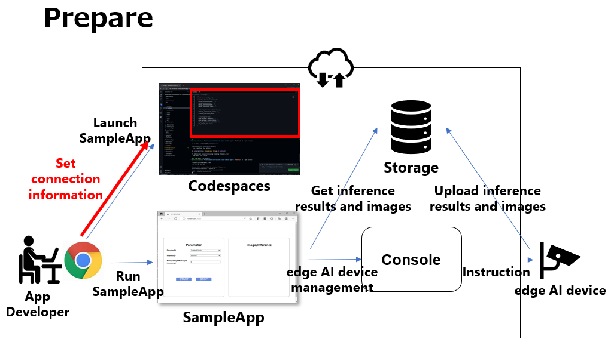
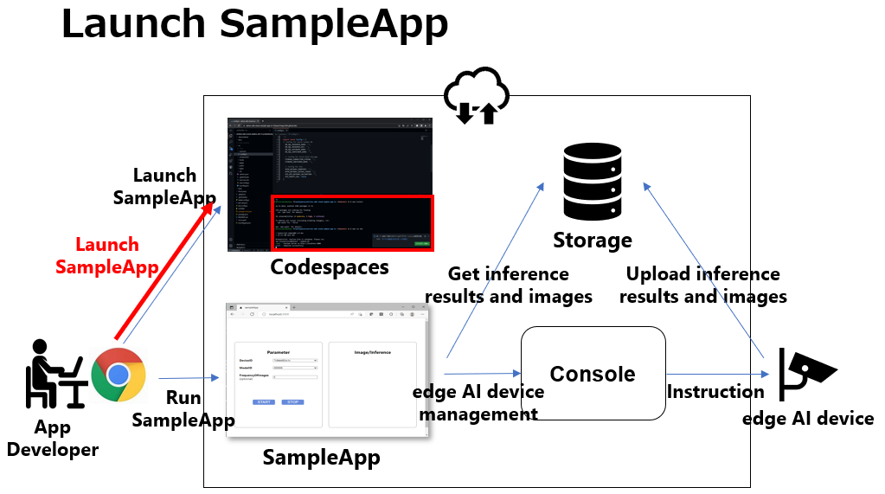
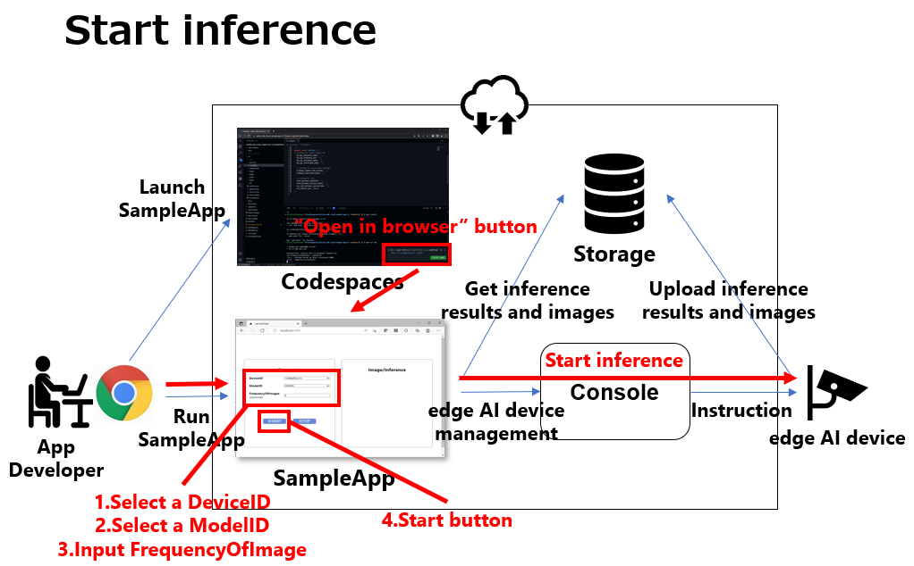
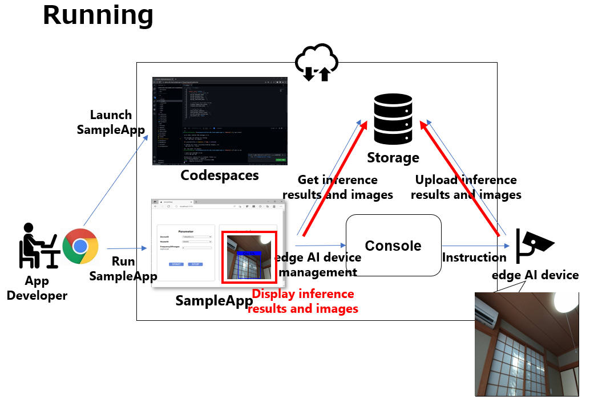
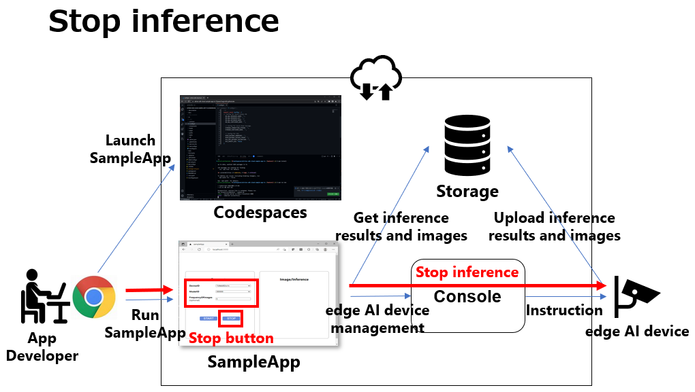

= Cloud SDK pass:[ ] Sample Application pass:[ ] TypeScript pass:[ ] Tutorial pass:[ ] 
:sectnums:
:sectnumlevels: 1
:author: Copyright 2023 Sony Semiconductor Solutions Corporation
:version-label: Version 
:revnumber: x.x.x
:revdate: YYYY - MM - DD
:trademark-desc1: AITRIOS™ and AITRIOS logos are the registered trademarks or trademarks
:trademark-desc2: of Sony Group Corporation or its affiliated companies.
:toc:
:toc-title: TOC
:toclevels: 1
:chapter-label:
:lang: en

== Change history

|===
|Date |What/Why 

|2022/12/12
|Initial draft

|2023/1/30
|Fixed typos + 
Unified the swinging of expressions + 
Fixed the notation + 
Fixed the text size of pictures + 
Updated the PDF build environment +
Changed the description of the [config.ts] in the sample application repository structure +
Changed the procedure for setting the connection information in the "Prepare to run the sample application" +
Changed implementation description for each use case for "**Cloud SDK**" 0.2.0

|2023/5/26
|Fixed the "Reference materials" in "Sample application repository structure" with FlatBuffers version up +
Fixed a lack of js-yaml in the "Package (framework) on which the sample application depends" +
Fixed a code misquote in the "Implementation description for each use case" + 
Fixed parenthesis notation for tool names + 
Added alternate text to images
|===

== Introduction
This tutorial explains a sample application using the "**Cloud SDK**". + 
This sample application demonstrates the basic use of the "**Cloud SDK**". + 
You can see how to control an edge AI device using the "**Cloud SDK**" and see the output of the edge AI device uploaded to the "**Console for AITRIOS**" (Hereafter referred to as "**Console**").

[#_precondition]
== Prerequisite
=== Connection information
To use the sample application, you need connection information to access the "**Console**" from the application. + 
The acquired information is used in <<#_Execute_sampleapp,"1.Prepare to run the sample application">>. + 
The required information is as follows:

* Client application details
** Refer to the client application list of "**Portal for AITRIOS**" or register the client application for the sample application if necessary to get the following information: 
See the "Issuing a Client Secret for SDK" in https://developer.aitrios.sony-semicon.com/en/documents/portal-user-manual["**Portal User Manual**"] for more information.
*** Client ID
*** Secret
+
** Get the following information from link:++https://developer.aitrios.sony-semicon.com/en/file/download/rest-api-authentication++[this material]:
*** Console endpoint
*** Portal authorization endpoint

=== Edge AI devices
In order for the sample application to work properly, the edge AI device must have specific settings. + 
Required settings are as follows:

* AI model and application are deployed
* AI model based on object detection is deployed
* From the "**Console**" UI, set the Command Parameter File to be used to the following setting:
+

** Mode=1(Image&Inference Result)
** UploadMethodIR="Mqtt"
** Other parameters need to be changed depending on the AI model and application content

== Sample application operating environment
See the https://developer.aitrios.sony-semicon.com/en/file/download/sdk-getting-started/["**SDK Getting Started**"].

== Sample application functional overview
The sample application implements the functionality required to specify an edge AI device enrolled in the "**Console**" and get inference results and images. + 
The following three functions are implemented:

* Get information about edge AI devices enrolled in the "**Console**"
* Instruct edge AI devices to start/stop inference
+
When an inference is started, the edge AI device uploads inference results/images to the "**Console**".
* Get inference results/images from the "**Console**", display gotten inference results and images

== Sample application repository structure
Sample application operating environment is as follows: + 
Omit parts that are not relevant to the implementation.
----
aitrios-sdk-cloud-app-sample-ts
├── src (1)
│   ├── common
│   │   └── config.ts (2)
│   ├── components (3)
│   │   ├── Button
│   │   │   └── index.tsx
│   │   └── DropDownList
│   │       └── index.tsx
│   ├── hooks
│   │   └── useInterval.js (4)
│   ├── next-env.d.ts
│   ├── pages
│   │   ├── api
│   │   │   ├── getCommandParameterFile.ts (5)
│   │   │   ├── getDeviceData.ts (6)
│   │   │   ├── getImageAndInference.ts (7)
│   │   │   ├── startUpload.ts (8)
│   │   │   └── stopUpload.ts (9)
│   │   ├── _app.tsx (10)
│   │   └── index.tsx (11)
│   ├── public
│   │   ├── favicon.ico (12)
│   │   └── label.json (13)
│   ├── styles
│   │   ├── globals.css (14)
│   │   └── Home.module.css (15)
│   ├── tsconfig.json (16)
│   └── util
│       ├── bounding-box.ts (17)
│       ├── bounding-box2d.ts (18)
│       ├── general-object.ts (19)
│       ├── object-detection-data.ts (20)
│       ├── object-detection-top.ts (21)
│       └── sample.ts (22)
----
(1) src : Sample application folder +
(2) config.ts : Logic for getting connection information to the "**Console**" +
(3) components : Button / DropDownList component logic storage folder +
(4) useInterval.js : Interval logic +
(5) getCommandParameterFile.ts : Logic to get parameters for the edge AI device +
(6) getDeviceData.ts : Logic to get information about edge AI devices enrolled in the "**Console**" +
(7) getImageAndInference.ts : Logic to get inference results and images from cloud storage +
(8) startUpload.ts : Logic to start inference +
(9) stopUpload.ts : Logic to stop inference +
(10) _app.tsx : Initializing the sample application frontend +
(11) index.tsx : Sample application frontend UI +
(12) favicon.ico : Symbol icons for the sample application +
(13) label.json : Inference result display label +
(14) globals.css : Sample application frontend style sheet +
(15) Home.module.css : Sample application frontend style sheet +
(16) tsconfig.json : Compiler configuration file +
(17) bounding-box.ts : Source code to deserialize +
(18) bounding-box2d.ts : Source code to deserialize +
(19) general-object.ts : Source code to deserialize +
(20) object-detection-data.ts : Source code to deserialize +
(21) object-detection-top.ts : Source code to deserialize +
(22) sample.ts : TypeScript logic running in the sample application frontend UI

=== Source code commentary

The following figure provides an overview of the sample application:

image::diagram_ts.png[alt="Overview of the sample application", width="400", align="center"]

The sample application consists of the Next.js framework.

Call the "**Cloud SDK**" from the sample application to control the edge AI device through the "**Console**". + 
Data from edge AI devices is stored in the "**Console**". + 
Sample application uses the "**Cloud SDK**" to get data from the "**Console**".

=== Package (framework) on which the sample application depends

* "**Console Access Library**"
* https://nodejs.org/en/download/[node]
* https://github.com/axios/axios[axios]
* https://github.com/acode/lib-node[lib]
* https://nextjs.org/[next]
* https://reactjs.org/[react]
* https://reactjs.org/docs/react-dom.html[react-dom]
* https://google.github.io/flatbuffers/[FlatBuffers]
* https://github.com/nodeca/js-yaml[js-yaml]

[#_Execute_sampleapp]
== How to run the sample application
Use the connection information prepared in the <<#_precondition,"Prerequisite">>

=== 1.Prepare to run the sample application
Create the [console_access_settings.yaml] under the [src/common] on Codespaces and set the connection information.

|===
|src/common/console_access_settings.yaml
a|
[source, Yaml]
----
console_access_settings:
  console_endpoint: "Console endpoint"
  portal_authorization_endpoint: "Portal authorization endpoint"
  client_secret: "Secret"
  client_id: "Client ID"
----
|===
* Specify the gotten console endpoint in `**console_endpoint**`. +
* Specify the gotten portal authorization endpoint in `**portal_authorization_endpoint**`. +
* Specify the secret of the registered application to the `**client_secret**`. +
* Specify the client ID of the registered application to the `**client_id**`. +

IMPORTANT: The combination of the client ID and secret is access information to the "**Console**". +
Do not publish or share with others and handle with care.
  
NOTE: To run the sample application in a proxy environment, set the `**https_proxy**` environment variable.
  

=== 2.Launch the sample application
From the Codespaces terminal, install the package and launch the sample application.
 
....
$ npm install
$ npm run dev
....

=== 3.Start inference
Start inference by launching sample application in the browser from the Codespaces dialog.
. Select a Device ID from the list of [**DeviceID**]
. Click the [**START**] to start inference for the edge AI device

=== 4.Review inference results and images
While inference is starting, the "**Image/Inference**" area displays an image and inference results.

=== 5.Stop inference
Click the [**STOP**] in the sample application to stop inference for the edge AI device.

== Implementation description for each use case

=== 1.Get information about edge AI devices enrolled in the "**Console**"

To use the "**Console**", generate a Client for the "**Cloud SDK**". + 
Use the functions provided by the "**Console**" from the generated Client.

* Import library 
+
[source, TypeScript]
----
import { Client, Config } from 'consoleAccessLibrary'
----
+
Import the libraries required for "**Cloud SDK**" client generation, as preceding.

* "**Cloud SDK**" client generation
+
[source, TypeScript]
----
const config = new Config(console_endpoint, portal_authorization_endpoint, client_id, client_secret);
const client = await Client.createInstance(config)
----
In the preceding source code, generate the client for the "**Cloud SDK**". + 
Specify the connection information to the `**Config**` and generate the `**config**`. + 
Specify the `**config**` to the `**Client**` and generate the `**client**`.

* Get device information
+
[source, TypeScript]
----
const config = new Config(console_endpoint, portal_authorization_endpoint, client_id, client_secret);
const client = await Client.createInstance(config)
const queryParams = {}
const res = await client?.deviceManagement?.getDevices(queryParams)
----
In the preceding example, get information about the enrolled edge AI devices from the "**Console**". + 
Use the generated client and run the `**getDevices**` provided by the `**deviceManagement**` to get device information. + 
Optionally acquisition conditions is configurable to the `**queryParams**`.

* Get device parameters
+
[source, TypeScript]
----
const config = new Config(console_endpoint, portal_authorization_endpoint, client_id, client_secret);
const client = await Client.createInstance(config)
const res = await client?.deviceManagement?.getCommandParameterFile()
----
Generate the `**client**` as preceding. + 
Get device parameters using the `**getCommandParameterFile**` provided by the `**deviceManagement**` of the `**client**`.

=== 2.Instruct the edge AI devices to start inference

* Start inference
+
[source, TypeScript]
----
const config = new Config(console_endpoint, portal_authorization_endpoint, client_id, client_secret);
const client = await Client.createInstance(config)
const res = await client?.deviceManagement?.startUploadInferenceResult(deviceId)
----
Generate the `**client**` as preceding. + 
Start inference using the `**startUploadInferenceResult**` provided by the `**deviceManagement**` of the `**client**`.

=== 3.Get inference results and images from the "**Console**"
Use the functionality provided by client to get inference results and images from the "**Console**".

* Get an image list
+
[source, TypeScript]
----
const config = new Config(console_endpoint, portal_authorization_endpoint, client_id, client_secret);
const client = await Client.createInstance(config)
const imageData = await client?.insight?.getImages(deviceId, subDirectoryName, numberOfImages, skip, orderBy)
----
Generate the `**client**` as preceding. + 
Get the image list using the `**getImages**` provided by the `**insight**`.

* Get the latest image and link it to the inference result
+
[source, TypeScript]
----
const config = new Config(console_endpoint, portal_authorization_endpoint, client_id, client_secret);
const client = await Client.createInstance(config)
const orderBy = 'DESC'
const numberOfImages = 1
const skip = 0
const imageData = await client?.insight?.getImages(deviceId, outputSubDir, numberOfImages, skip, orderBy)
const latestImage = imageData.data.images[0]
const ts = (latestImage.name).replace('.jpg', '')
const base64Img = `data:image/jpg;base64,${latestImage.contents}`
----
The preceding source code gets the latest image information from an image list. + 
Get the latest image data into the `**base64Img**`. + 
Get the timestamp of the latest image into the `**ts**`. + 
Inference results and images are linked by their respective timestamps. + 
Call the function to get inference results linked to images using the `**ts**`.

* Get inference results linked to the latest image
+
[source, TypeScript]
----
const config = new Config(console_endpoint, portal_authorization_endpoint, client_id, client_secret);
const client = await Client.createInstance(config)
const filter = undefined
const NumberOfInferenceResults = 1
const raw = 1
const time = ts
const resInference = await client?.insight?.getInferenceResults(deviceId, filter, NumberOfInferenceResults, raw, time)
----
Generate the `**client**` as preceding. + 
Get the list of inference results using the `**getInferenceresults**` provided by the `**insight**`. + 
`**filter**` is the argument that specifies a search filter. + 
Specify the number of inference results to get by the `**NumberOfInferenceresults**`. + 
`**raw**` is the argument for accessing the stored inference result. + 
Specify the timestamp of inference results to get by the `**time**`.

* Deserialize inference results
+
[source, TypeScript]
----
const deserializedInferenceData = deserialize(inferenceData)
----
The preceding source code converts the inference results gotten from the "**Console**" into a format that can be referenced. + 
See the https://github.com/SonySemiconductorSolutions/aitrios-sdk-deserialization-sample["Cloud SDK Deserialize Sample"] for details of this conversion process.

=== 4.Instruct the edge AI devices to stop inference

* Stop inference
+
[source, TypeScript]
----
const config = new Config(console_endpoint, portal_authorization_endpoint, client_id, client_secret);
const client = await Client.createInstance(config)
const res = await client?.deviceManagement?.stopUploadInferenceResult(deviceId)
----
To stop inference of the edge AI device, run the `**stopUploadInferenceResult**` provided by the `**deviceManagement**` of the `**client**` as preceding. + 
Specify the Device ID to stop by the `**deviceId**`.

== Reference materials

=== Display gotten inference results (Sample application display processing)

[source, JavaScript]
----
type InferenceItem = {
  'class_id': number, // Index of the object label
  'score': number,    // Confidence of the object label
  'left': number,     // X-coordinate start position of the object
  'top': number,      // Y coordinate start position of the object
  'right': number,    // X-coordinate end position of the object
  'bottom': number    // Y coordinate end position of the object
}
const drawBoundingBox = (image, inferenceData, context, labels) => {
  if (context !== null) {
    const img = new window.Image()
    img.src = image
    img.onload = () => {
      const canvas = document.getElementById('canvas') as HTMLCanvasElement
      canvas.width = img.width
      canvas.height = img.height
      context.drawImage(img, 0, 0)

      // Display gotten inference results
      for (const [key, value] of Object.entries(inferenceData)) {
        if (key === 'T') continue
        const v = value as InferenceItem
        context.lineWidth = 3
        context.strokeStyle = 'rgb(255, 255, 0)'

        // Specify bounding box coordinates
        context.strokeRect(v.left, v.top, Math.abs(v.left - v.right), Math.abs(v.top - v.bottom))

        // Specify coordinates to display labels
        const labelPointX = (v.right > 270 ? v.right - 70 : v.right)
        const labelPointY = (v.bottom > 300 ? v.bottom - 10 : v.bottom)

        context.font = '20px Arial'
        context.fillStyle = 'rgba(255, 255, 0)'

        // Display the label and confidence
        context.fillText(`${labels[v.class_id]} ${Math.round(v.score * 100)}%`, labelPointX, labelPointY)
      }
    }
  }
}
----

* Format of image paths taken as an image list
+
----
<blobcontainer_name>/<deviceId>/JPG/<subDirectoryName>/YYYYMMDDHHMMSSFFF.jpg
----
* Sample data of inference result (object detection) + 
Inferences[] is the inference result + 
In the following sample data, there are two object detections + 
The detection results are serialized, but the following sample data is in deserialized data format.
+
[source, Json]
----
{
    "DeviceID": "123456789ABC",
    "ModelID": "0000000000000000",
    "Image": true,
    "Inferences": [
        {
            "1": {
                "class_id": 18,
                "score": 0.03125,
                "left": 8,
                "top": 0,
                "right": 303,
                "bottom": 107
            },
            "2": {
                "class_id": 19,
                "score": 0.02734375,
                "left": 2,
                "top": 230,
                "right": 38,
                "bottom": 319
            },
            "T": "20220101010101000"
        }
    ],
    "id": "00000000-0000-0000-0000-000000000000",
    "_rid": "AAAAAAAAAAAAAAAAAAAAAA==",
    "_self": "dbs/XXXXXX==/colls/CCCCCCCCCCCC=/docs/AAAAAAAAAAAAAAAAAAAAAA==/",
    "_etag": "\"00000000-0000-0000-0000-000000000000\"",
    "_attachments": "attachments/",
    "_ts": 1111111111
}
----
+
The parameters of the detection result are as follows:
+
class_id: Index of the object label
+
score: Confidence of the object label
+
left: X-coordinate start position of the object
+
top: Y coordinate start position of the object
+
right: X-coordinate end position of the object
+
bottom: Y coordinate end position of the object
