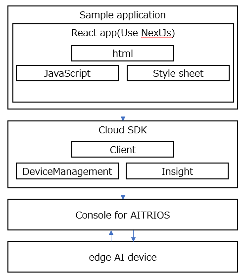
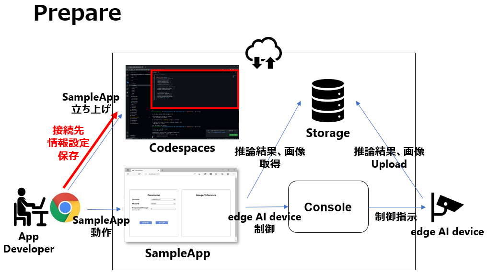
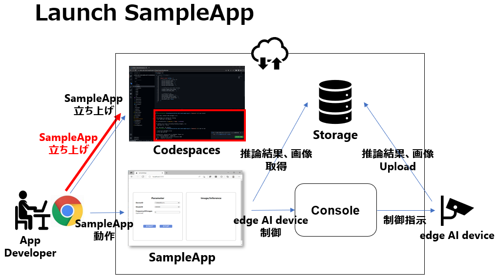
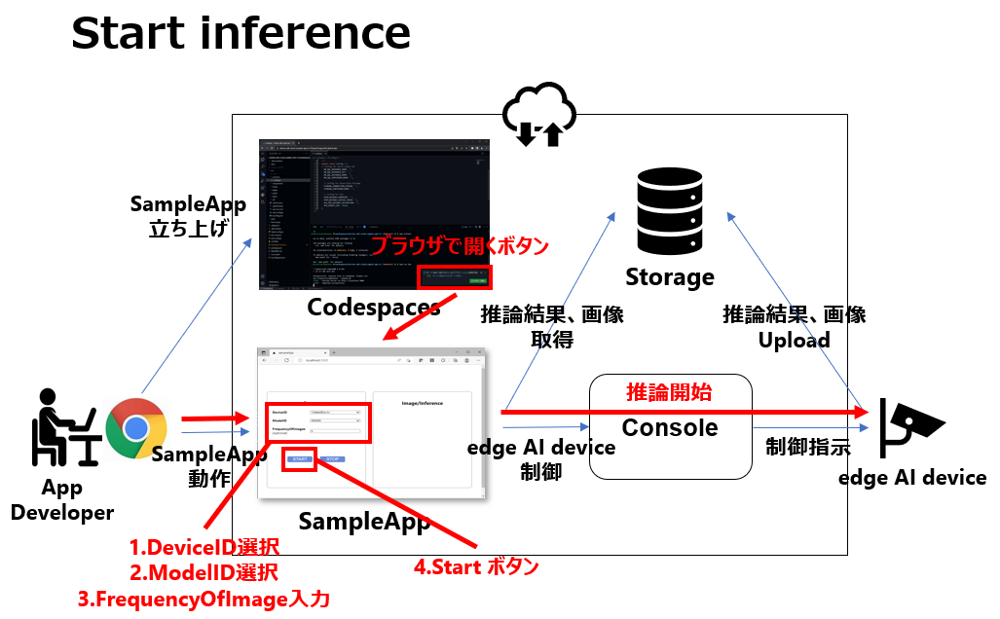
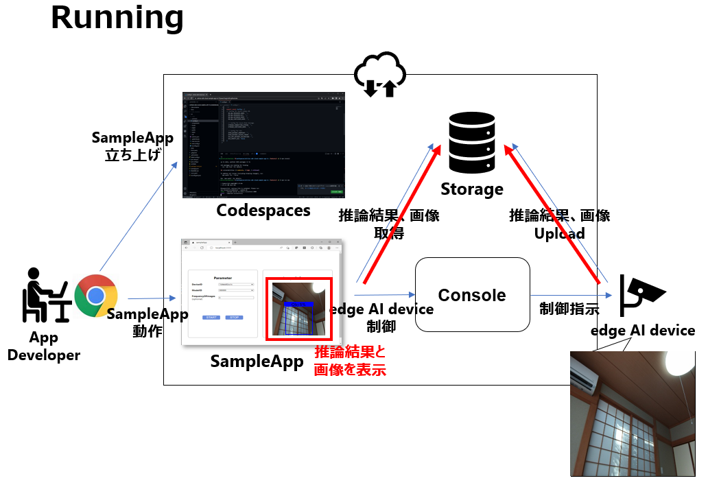
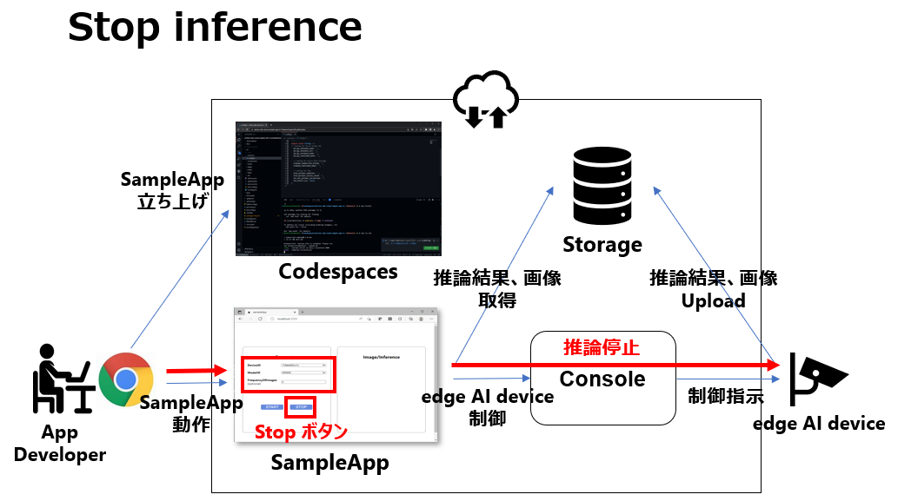

= Cloud SDK pass:[ ] サンプルアプリケーション pass:[ ] TypeScript版 pass:[ ] チュートリアル pass:[ ] 
:sectnums:
:sectnumlevels: 1
:author: Copyright 2023 Sony Semiconductor Solutions Corporation
:version-label: Version 
:revnumber: x.x.x
:revdate: YYYY - MM - DD
:trademark-desc: AITRIOS™、およびそのロゴは、ソニーグループ株式会社またはその関連会社の登録商標または商標です。
:toc:
:toc-title: 目次
:toclevels: 1
:chapter-label:
:lang: ja

== 更新履歴

|===
|Date |What/Why 

|2022/12/12
|初版作成

|2023/1/30
|誤記修正 + 
表現統一 + 
記法修正 + 
図文字サイズ修正 + 
PDFビルド環境更新 +
サンプルアプリケーションリポジトリ構成の[config.ts]の説明変更 +
「サンプルアプリケーション実行の準備をする」の接続先情報設定方法変更 +
ユースケース毎の実装説明の「**Cloud SDK**」の0.2.0対応

|2023/5/26
|FlatBuffers version upにともなう「サンプルアプリケーションリポジトリ構成」「参考資料」修正 +
「サンプルアプリケーションが依存するPackage（フレームワーク）」にjs-yaml不足していたため追加 +
「ユースケース毎の実装説明」のコード引用ミス修正 + 
ツール名の括弧の表記の修正 + 
図の代替テキスト追加

|2023/12/22
|Console Developer EditionとConsole Enterprise Edition対応

|===

== はじめに
このチュートリアルでは、「**Cloud SDK**」を用いたサンプルアプリケーションについて解説します。 +
このサンプルアプリケーションは、「**Cloud SDK**」の基本的な使い方を体験して頂くために用意しています。 +
サンプルアプリケーションでは、「**Cloud SDK**」を利用してエッジAIデバイスを制御する方法と、「**Console for AITRIOS**」 (以下、「**Console**」と記載)もしくは「Azure Blob Storage」もしくは「Local Storage」UploadされたエッジAIデバイスの出力を確認する方法を確認できます。 +
ただし、「Local Storage」へアップロードされた推論結果を確認する場合、Codespacesは利用できません。

[#_precondition]
== 前提条件
=== 接続情報
サンプルアプリケーションを使用するには、アプリケーションから「**Console**」へアクセスするための接続情報が必要になります。 +
取得した情報は<<#_Execute_sampleapp,「1.サンプルアプリケーション実行の準備をする」>>で利用します。 +
必要な接続情報は下記の通りです。

* クライアントアプリケーション詳細情報
- 「**Console Developer Edition**」を使用している場合
** 「**Portal for AITRIOS**」のクライアントアプリケーション一覧から参照または、必要に応じてサンプルアプリケーション向けのクライアントアプリケーション登録を行い、下記情報の取得を行ってください。
詳細は、 https://developer.aitrios.sony-semicon.com/documents/portal-user-manual[「**Portalユーザーマニュアル**」] の「SDK用のClient Secretを発行する」をお読みください。
*** クライアントID
*** シークレット
+
** https://developer.aitrios.sony-semicon.com/file/download/rest-api-authentication[こちらのドキュメント] から下記の情報を取得してください。
*** コンソールエンドポイント
*** ポータル認証エンドポイント

- 「**Console Enterprise Edition**」を使用している場合
** 「**Console**」の導入担当者(Service Administrator)に問い合わせください。

「Azure Blob Storage」を使用するには、「Azure Blob Storage」へアクセスするための接続情報が必要になります。
詳細は、 https://learn.microsoft.com/en-us/azure/storage/common/storage-configure-connection-string#configure-a-connection-string-for-an-azure-storage-account[ 「**Configure a connection string for an Azure storage account**」 ]をお読みください。

=== エッジAIデバイス
サンプルアプリケーションを正常に動作させるためには、利用するエッジAIデバイスに特定の設定が必要になります。 +
必要な設定内容は下記の通りです。

* AIモデルやアプリケーションがデプロイされていること
* AIモデルに、Object DetectionのAIモデルがデプロイされていること
* 「**Console**」のUIから、利用するCommand Parameter Fileを下記の設定にしておくこと
** 「**Console**」利用時 +
記述しなかった場合は以下の値が自動で設定されます。 +
UploadMethod="BlobStorage" +
UploadMethodIR="Mqtt"
** 「Azure Blob Storage」 +
UploadMethod="BlobStorage" +
UploadMethodIR="BlobStorage"
** 「Local Storage」 +
UploadMethod="HTTPStorage" +
UploadMethodIR="HTTPStorage" 
+
** AIモデルやアプリケーションの内容に応じて、その他のパラメータも変更する必要がある

=== 外部転送設定
* 「Azure Blob Storage」利用時 +
「Azure Blob Storage」を使用する場合は、 https://developer.aitrios.sony-semicon.com/edge-ai-sensing/documents/external-transfer-settings-tutorial-for-azure-blob-storage[外部転送設定チュートリアル(Azure Blob Storage)]の設定を完了させてください。
* 「Local Storage」利用時 +
「Local Storage」を使用する場合は、 https://developer.aitrios.sony-semicon.com/edge-ai-sensing/documents/external-transfer-settings-tutorial-for-http-server[外部転送設定チュートリアル(Local HTTP Server)]の設定を完了させてください。
+
IMPORTANT: デバイスからHTTP ServerへのアップロードはHTTP通信のため暗号化されません。

== サンプルアプリケーション動作環境
https://developer.aitrios.sony-semicon.com/downloads#sdk-getting-started[「**SDK スタートガイド**」]を参照してください。

== サンプルアプリケーション機能概要
サンプルアプリケーションでは、「**Console**」に登録されたエッジAIデバイスを指定し、アプリケーションが推論結果と画像を取得するために必要な機能を実装しています。 +
実装されている機能は下記の三点です。

* 「**Console**」に登録されたエッジAIデバイスの情報取得
* エッジAIデバイスへの推論開始・停止指示
+
推論開始を行うことによって、エッジAIデバイスは推論結果・画像を「**Console**」もしくは「Azure Blob Storage」もしくは「Local Storage」へUploadします。
* 推論結果・画像の取得、取得結果の表示
+
「**Console**」もしくは「Azure Blob Storage」もしくは「Local Storage」にアップロードされたデータを表示します。

== サンプルアプリケーションリポジトリ構成
サンプルアプリケーションの動作環境は下記の通りです。 +
実装にかかわらない部分に関しては省略します。
----
aitrios-sdk-cloud-app-sample-ts
├── src (1)
│   ├── common
│   │   └── config.ts (2)
│   │   └── settings.ts (3)
│   ├── components (4)
│   │   ├── Button
│   │   │   └── index.tsx
│   │   └── DropDownList
│   │       └── index.tsx
│   ├── hooks
│   │   └── getAzureStorage.ts (5)
│   │   └── getConsoleStorage.ts (6)
│   │   └── getLocalStorage.ts (7)
│   │   └── getStorageData.ts (8)
│   │   └── useInterval.js (9)
│   ├── next-env.d.ts
│   ├── pages
│   │   ├── api
│   │   │   ├── getCommandParameterFile.ts (10)
│   │   │   ├── getDeviceData.ts (11)
│   │   │   ├── getImageAndInference.ts (12)
│   │   │   ├── startUpload.ts (13)
│   │   │   └── stopUpload.ts (14)
│   │   ├── _app.tsx (15)
│   │   └── index.tsx (16)
│   ├── public
│   │   ├── favicon.ico (17)
│   │   └── label.json (18)
│   ├── styles
│   │   ├── globals.css (19)
│   │   └── Home.module.css (20)
│   ├── tsconfig.json (21)
│   └── util
│   │   ├── bounding-box.ts (22)
│   │   ├── bounding-box2d.ts (23)
│   │   ├── general-object.ts (24)
│   │   ├── object-detection-data.ts (25)
│   │   ├── object-detection-top.ts (26)
│   │   └── sample.ts (27)
│   └── checkLocalRoot.ts (28)
│   └── tsconfig.node.json  (29)
----
(1) src: サンプルアプリケーション格納フォルダ +
(2) config.ts : 「**Console**」もしくは「Azure Blob Storage」への接続情報取得ロジック +
(3) settings.ts : 接続先と「Local Storage」のパス指定を行う +
(4) components : Button / DropDownListコンポーネントロジック格納フォルダ +
(5) getAzureStorage.ts : 「Azure Blob Storage」から推論結果や画像を取得するロジック +
(6) getConsoleStorage.ts : 「**Console**」から推論結果や画像を取得するロジック +
(7) getLocalStorage.ts : 「Local Storage」から推論結果や画像を取得するロジック +
(8) getStorageData.ts : 利用するStorageを判定し該当Storageのロジックを呼び出す +
(9) useInterval.js : インターバルロジック +
(10) getCommandParameterFile.ts : エッジAIデバイスのパラメータ取得ロジック +
(11) getDeviceData.ts : 「**Console**」に登録されたエッジAIデバイスの情報取得ロジック +
(12) getImageAndInference.ts : 推論結果と画像を取得するロジック +
(13) startUpload.ts : 推論開始ロジック +
(14) stopUpload.ts : 推論停止ロジック +
(15) _app.tsx : サンプルアプリケーションのフロントエンド初期化 +
(16) index.tsx : サンプルアプリケーションのフロントエンドUI +
(17) favicon.ico : サンプルアプリケーションのシンボルアイコン +
(18) label.json : 推論結果の表示ラベル +
(19) globals.css : サンプルアプリケーションのフロントエンドスタイルシート +
(20) Home.module.css : サンプルアプリケーションのフロントエンドスタイルシート +
(21) tsconfig.json : コンパイラ設定ファイル +
(22) bounding-box.ts : Deserialize用ソースコード +
(23) bounding-box2d.ts : Deserialize用ソースコード +
(24) general-object.ts : Deserialize用ソースコード +
(25) object-detection-data.ts : Deserialize用ソースコード +
(26) object-detection-top.ts : Deserialize用ソースコード +
(27) sample.ts : サンプルアプリケーションのフロントエンドUIで動作するTypeScriptロジック +
(28) checkLocalRoot.ts : LOCAL_ROOTの設定値を確認する +
(29) tsconfig.node.json : コンパイラ設定ファイル

=== ソースコードの解説

サンプルアプリケーションの概要は下記の図のようになります。

サンプルアプリケーションはNext.jsフレームワークで構成しています。

サンプルアプリケーションから「**Cloud SDK**」を呼び出し、「**Console**」を経由してエッジAIデバイスを制御します。 +
エッジAIデバイスが取得したデータは「**Console**」もしくは「Azure Blob Storage」もしくは「Local Storage」に保存されます。 +
サンプルアプリケーションは「**Cloud SDK**」等を使用して「**Console**」もしくは「Azure Blob Storage」もしくは「Local Storage」からデータを取得します。

=== サンプルアプリケーションが依存するPackage（フレームワーク）

* 「**Console Access Library**」
* https://nodejs.org/en/download/[node]
* https://github.com/axios/axios[axios]
* https://github.com/acode/lib-node[lib]
* https://nextjs.org/[next]
* https://reactjs.org/[react]
* https://reactjs.org/docs/react-dom.html[react-dom]
* https://google.github.io/flatbuffers/[FlatBuffers]
* https://github.com/nodeca/js-yaml[js-yaml]
* https://github.com/Azure/azure-sdk-for-js[azure-sdk-for-js]

[#_Execute_sampleapp]
== サンプルアプリケーション実行方法
<<#_precondition,前提条件>>で用意した接続情報を使用します。

=== 1.サンプルアプリケーション実行の準備をする
. Codespaces上または、リポジトリをCloneした環境上で [src/common]配下に[console_access_settings.yaml]を作成し接続先情報を設定します。

- 「**Console Developer Edition**」を使用している場合
+
|===
|src/common/console_access_settings.yaml
a|
[source,Yaml]
----
console_access_settings:
  console_endpoint: "コンソールエンドポイント"
  portal_authorization_endpoint: "ポータル認証エンドポイント"
  client_secret: "シークレット"
  client_id: "クライアントID"
----
|===
+
* `**console_endpoint**` に、コンソールエンドポイントを指定します。 +
* `**portal_authorization_endpoint**` に、ポータル認証エンドポイントを指定します。 +
* `**client_secret**` に、登録したアプリケーションのシークレットを指定します。 +
* `**client_id**` に、登録したアプリケーションのクライアントIDを指定します。 +
+

IMPORTANT: クライアントIDとシークレットの取得方法詳細は、 https://developer.aitrios.sony-semicon.com/documents/portal-user-manual[「**Portalユーザーマニュアル**」] の「SDK用のClient Secretを発行する」をお読みください。 + 
コンソールエンドポイントとポータル認証エンドポイントの取得方法詳細は、link:++https://developer.aitrios.sony-semicon.com/file/download/rest-api-authentication++[こちらのドキュメント] をお読みください。 +
これらは「**Console**」へのアクセス情報となります。 + 
公開したり、他者との共有をせず、取り扱いには十分注意してください。
+
NOTE: Proxy環境でサンプルアプリケーション実行する場合、環境変数 `**https_proxy**` の設定をしてください。

- 「**Console Enterprise Edition**」を使用している場合
+
|===
|src/common/console_access_settings.yaml
a|
[source,Yaml]
----
console_access_settings:
  console_endpoint: "コンソールエンドポイント"
  portal_authorization_endpoint: "ポータル認証エンドポイント"
  client_secret: "シークレット"
  client_id: "クライアントID"
  application_id: "アプリケーションID"
----
|===
+
* `**console_endpoint**` に、コンソールエンドポイントを指定します。 +
* `**portal_authorization_endpoint**` に、ポータル認証エンドポイントを指定します。 +
ポータル認証エンドポイントは、 `**\https://login.microsoftonline.com/{テナントID}**`  の形式で指定します。 +
* `**client_secret**` に、登録したアプリケーションのシークレットを指定します。 +
* `**client_id**` に、登録したアプリケーションのクライアントIDを指定します。 +
* `**application_id**` に、登録したアプリケーションのアプリケーションIDを指定します。 +
+

IMPORTANT: コンソールエンドポイントとクライアントIDとシークレットとテナントIDとアプリケーションIDの取得方法詳細は、「**Console**」の導入担当者(Service Administrator)に問い合わせください。 +
これらは「**Console**」へのアクセス情報となります。 +
公開したり、他者との共有をせず、取り扱いには十分注意してください。 +
+
NOTE: Proxy環境でサンプルアプリケーション実行する場合、環境変数 `**https_proxy**` の設定をしてください。

. Codespacesまたは、リポジトリをCloneした環境上で [src/common]配下に[azure_access_settings.yaml]を作成し接続先情報を設定します。 +
本設定は、推論結果取得先が「Azure Blob Storage」の時に設定します。

+
|===
|src/common/azure_access_settings.yaml
a|
[source,Yaml]
----
azure_access_settings:
  connection_string: "接続情報"
  container_name: "コンテナ名"
----
|===
+
* `**connection_string**` に、「Azure Blob Storage」の接続情報を指定します。 +
* `**container_name**` に、「Azure Blob Storage」のコンテナ名を指定します。 +
+

IMPORTANT: これらは「Azure Blob Storage」へのアクセス情報となります。 +
公開したり、他者との共有をせず、取り扱いには十分注意してください。 +

. Codespacesまたは、リポジトリをCloneした環境上で [src/common]配下に[settings.ts]に接続先情報を設定します。
+
|===
|src/common/settings.ts
a|
[source,TypeScript]
----
export const SERVICE = {
  Console: 'console',
  Azure: 'azure',
  Local: 'local'
} as const
type SERVICE_TYPE = typeof SERVICE[keyof typeof SERVICE];

export const CONNECTION_DESTINATION: SERVICE_TYPE = SERVICE.Console
export const LOCAL_ROOT = ''
----
|===
+
* `**CONNECTION_DESTINATION**` に、推論結果取得先を設定します。デフォルト値は `**SERVICE.Console**` 設定です。 +
* `**LOCAL_ROOT**` に、「Local Storage」のパスを指定します。 +
本設定は、 `**CONNECTION_DESTINATION**` に `**SERVICE.Local**` を指定した場合に利用されます。 +

NOTE: Dev Container環境を利用する場合、Local Storageをgit cloneしたフォルダ内にフォルダ作成し、 +
`**LOCAL_ROOT**` には `**/workspace/{git cloneしたフォルダ内に作成したフォルダ}**` と設定する。

=== 2.サンプルアプリケーションを開始する
Codespacesまたは、リポジトリをCloneした環境上のターミナルからpackageのインストールとサンプルアプリケーションの起動を行います。
 
....
$ npm install
$ npm run build
$ npm run start
....

=== 3.推論を開始する
ブラウザからサンプルアプリケーションにアクセスして、各種操作を行います。

. ブラウザで http://localhost:3000 (Codespacesの場合は、ポート転送されたURL)を開く 
. [**DeviceID**]のリストからDevice IDを選択する
. [**START**]をクリックし、エッジAIデバイスの推論を開始する

=== 4.推論結果と画像を確認する
推論開始中は、"**Image/Inference**"エリアに画像と推論結果を表示します。

=== 5.推論を停止する
サンプルアプリケーションの[**STOP**]をクリックし、エッジAIデバイスの推論を停止します。

== ユースケース毎の実装説明

=== 1.「**Console**」に登録されたエッジAIデバイスの情報を取得する

「**Console**」を利用するために、「**Cloud SDK**」のClientを生成します。 +
生成したClientから、「**Console**」の提供する機能を利用します。

* ライブラリインポート
+
[source,TypeScript]
----
import { Client, Config } from 'consoleAccessLibrary'
----
+
上記のように、「**Cloud SDK**」のClient生成に必要なライブラリをimportします。

* 「**Cloud SDK**」のClient生成
+
[source,TypeScript]
----
const config = new Config(console_endpoint, portal_authorization_endpoint, client_id, client_secret, application_id)
const client = await Client.createInstance(config)
----
上記は、「**Cloud SDK**」のClientを生成するためのソースコードです。 +
`**Config**` に接続情報を指定し、 `**config**` を生成します。 +
`**Client**` に `**config**` を指定し、 `**client**` を生成します。

* デバイス情報取得
+
[source,TypeScript]
----
const config = new Config(console_endpoint, portal_authorization_endpoint, client_id, client_secret, application_id)
const client = await Client.createInstance(config)
const res = await client?.deviceManagement?.getDevices()
----
上記の例では、「**Console**」から登録されているエッジAIデバイスの情報を取得しています。 +
生成したClientを利用し、`**deviceManagement**` が提供する `**getDevices**` を実行することでデバイス情報を取得できます。 +
オプションで `**queryParams**` に取得条件を設定できます。

* デバイスパラメータ取得
+
[source,TypeScript]
----
const config = new Config(console_endpoint, portal_authorization_endpoint, client_id, client_secret, application_id)
const client = await Client.createInstance(config)
const res = await client.deviceManagement.getDevices()
----
上記のように、`**client**` を生成します。 +
`**client**` の `**deviceManagement**` が提供する `**getCommandParameterFile**` を使用してデバイスのパラメータを取得します。

=== 2.エッジAIデバイスへ推論開始を指示する

* 推論開始
+
[source,TypeScript]
----
const config = new Config(console_endpoint, portal_authorization_endpoint, client_id, client_secret, application_id)
const client = await Client.createInstance(config)
const res = await client.deviceManagement.getCommandParameterFile()
----
上記のように、`**client**` を生成します。 +
`**client**` の `**deviceManagement**` が提供する `**startUploadInferenceResult**` を使用して推論を開始します。

=== 3.「**Console**」の推論結果・画像を取得する
「**Console**」から推論結果・画像を取得するために、Clientが提供する機能を利用します。

* 画像リストを取得する
+
[source,TypeScript]
----
const config = new Config(console_endpoint, portal_authorization_endpoint, client_id, client_secret, application_id)
const client = await Client.createInstance(config)
const imageData = await client.insight.getImageData(deviceId, subDirectory, numberOfImages, skip, orderBy)
----
上記のように、`**client**` を生成します。 +
`**insight**` が提供する `**getImages**` を使用して画像リストを取得します。 +

* 最新の画像を取得し、推論結果と紐付ける
+
[source,TypeScript]
----
const config = new Config(console_endpoint, portal_authorization_endpoint, client_id, client_secret, application_id)
const client = await Client.createInstance(config)
const orderBy = 'DESC'
const numberOfImages = 1
const skip = 0
const imageData = const imageData = await client.insight.getImageData(deviceId, subDirectory, numberOfImages, skip, orderBy)
const latestImage = imageData.data.images[0]
const ts = (latestImage.name).replace('.jpg', '')
const base64Img = `data:image/jpg;base64,${latestImage.contents}`
----
上記のソースコードで、画像のリストから最新の画像情報を取得します。 +
`**base64Img**` に、最新の画像データを取得します。 +
`**ts**` に、最新の画像のタイムスタンプを取得します。 +
推論結果と画像はそれぞれのタイムスタンプで紐づいています。 +
`**ts**` を使用して、画像に紐づいた推論結果の取得関数を呼び出します。

* 最新の画像に紐づく推論結果を取得する
+
[source,TypeScript]
----
const config = new Config(console_endpoint, portal_authorization_endpoint, client_id, client_secret, application_id)
const client = await Client.createInstance(config)
const filter = `EXISTS(SELECT VALUE i FROM i IN c.Inferences WHERE i.T >= "${startTime}" AND i.T <= "${endTime}")`
const NumberOfInferenceResults = 1
const raw = 1
const time = undefined
const resInference = await client.insight.getInferenceResults(deviceId, filter, numberOfInferenceResult, raw, time)
----
上記のように、`**client**` を生成します。 +
`**insight**` が提供する `**getInferenceResults**` を使用して推論結果のリストを取得します。 +
`**filter**` は検索フィルタを指定する引数です。 +
`**NumberOfInferenceResults**` で、取得する推論結果の数を指定します。 +
`**raw**` は格納された推論結果にアクセスするための引数です。 +
`**time**` は、取得する推論結果のタイムスタンプを指定します。

* 推論結果のDeserialize
+
[source,TypeScript]
----
const deserializedInferenceData = deserialize(inferenceData)
----
上記のソースコードでは、「**Console**」から取得した推論結果を参照可能な形式へ変換する処理を行っています。 +
この変換処理の詳細について、 https://github.com/SonySemiconductorSolutions/aitrios-sdk-deserialization-sample[「Cloud SDK Deserialize サンプル」] を参照してください。

=== 4.「Azure Blob Storage」の推論結果・画像を取得する
「Azure Blob Storage」から推論結果・画像を取得するために、hooksディレクトリ配下のgetAzureStorage.tsを利用します。

* 画像リストを取得する
+
[source,TypeScript]
----
export async function getImageFromAzure (deviceId: string, subDirectory: string, orderBy?: string, skip?: number, numberOfImages?: number) {
  const containerClient = getBlobService()
  const blobNames = []
  const prefix = `${deviceId}/image/${subDirectory}/`
  orderBy = orderBy || 'ASC' // ASC is cal default value
  skip = skip || 0 // 0 is cal default value
  numberOfImages = numberOfImages || 50 // 50 is cal default value
  for await (const blob of containerClient.listBlobsFlat({ prefix })) {
    blobNames.push(blob.name)
  }
  if (orderBy === 'DESC') {
    blobNames.reverse()
  }

  const images = []
  for (let i = 0; i < blobNames.length; i++) {
    if (i === numberOfImages) break
    if (blobNames[i + skip] === undefined) {
      break
    }
    const blockBlobClient = containerClient.getBlockBlobClient(blobNames[i + skip])
    const buffer = await blockBlobClient.downloadToBuffer()
    images.push({
      name: blobNames[i + skip].split('/')[3],
      contents: buffer.toString('base64')
    })
  }

  const response = {
    total_image_count: blobNames.length,
    images
  }
  return response
}
----
`**azure-sdk-for-js**` が提供する `**listBlobsFlat**` を使用して画像ファイル名のリストを取得します。 +
`**azure-sdk-for-js**` が提供する `**getBlockBlobClient**` と `**downloadToBuffer**` を利用して画像データを取得します。 +
画像ファイル名とbase64を作成し、`**total_image_count**` と合わせて返却します。

* 最新の画像に紐づく推論結果を取得する
+
[source,TypeScript]
----
export async function getInferenceFromAzure (retryCount: number, deviceId: string, subDirectory: string, startInferenceTime?: string, endInferenceTime?: string, numberOfInferenceResult?: number): Promise<string[]> {
  const serializeDatas: string[] = []
  if (retryCount === 0) {
    return serializeDatas
  }
  const containerClient = getBlobService()
  const blobs = []
  numberOfInferenceResult = numberOfInferenceResult || 20 // 20 is cal default value
  const prefix = `${deviceId}/metadata/${subDirectory}/`

  for await (const blob of containerClient.listBlobsByHierarchy('/', { prefix })) {
    const filePath = blob.name
    const timestamp = filePath.split('/')[3].replace('.txt', '')
    if ((startInferenceTime === undefined || timestamp >= startInferenceTime) &&
      (endInferenceTime === undefined || timestamp < endInferenceTime)) {
      blobs.push(blob.name)
    } else if (endInferenceTime !== undefined && timestamp > endInferenceTime) {
      break
    }
    if (blobs.length === numberOfInferenceResult) break
  }

  if (!(blobs.length === 0)) {
    for (let i = 0; i < blobs.length; i++) {
      const blobClient = containerClient.getBlobClient(blobs[i])
      const blobInferenceResponse = await blobClient.download(0)
      const inferenceText = await streamToString(blobInferenceResponse.readableStreamBody)
      const inferenceJson = JSON.parse(inferenceText)
      serializeDatas.push(inferenceJson)
    }
    return serializeDatas
  } else {
    await setTimeout(1000)
    return getInferenceFromAzure(retryCount - 1, deviceId, subDirectory, startInferenceTime, endInferenceTime, numberOfInferenceResult)
  }
}
----
`**azure-sdk-for-js**` が提供する `**listBlobsByHierarchy**` を使用して推論結果ファイル名のリストを取得します。 +
取得した推論結果ファイル名のタイムスタンプが指定範囲内か確認します。 +
`**azure-sdk-for-js**` が提供する `**getBlobClient**` や `**download**` を利用して推論結果データを取得します。 +
`**startInferenceTime**` は検索開始位置を表すタイムスタンプです。 +
`**endInferenceTime**` は検索終了位置を表すタイムスタンプです。 +
`**numberOfInferenceResult**` は取得する推論結果の数です。 +

=== 5.「Local Storage」の推論結果・画像を取得する
「Local Storage」から推論結果・画像を取得するために、hooksディレクトリ配下のgetLocalStorage.tsを利用します。

* 画像リストを取得する
+
[source,TypeScript]
----
export function getImageFromLocal (deviceId: string, subDirectory: string, orderBy?: string, skip?: number, numberOfImages?: number) {
  const storagePath = path.join(LOCAL_ROOT, deviceId, 'image', subDirectory)
  isRelativePath(storagePath)
  orderBy = orderBy || 'ASC' // ASC is cal default value
  skip = skip || 0 // 0 is cal default value
  numberOfImages = numberOfImages || 50 // 50 is cal default value
  const images: any = []
  isStoragePathFile(storagePath)
  const files = fs.readdirSync(storagePath)
  const imagesFiles = files.filter(file => {
    const extension = path.extname(file).toLowerCase()
    return extension === '.jpg'
  })
  if (orderBy === 'DESC') {
    imagesFiles.reverse()
  }
  for (let i = 0; i < numberOfImages; i++) {
    if (imagesFiles[i + skip] === undefined) {
      break
    }
    const filePath = path.join(storagePath, imagesFiles[i + skip])
    isRelativePath(filePath)
    isSymbolicLinkFile(filePath)
    const data = fs.readFileSync(filePath)
    const base64Image = base64.fromByteArray(data)
    images.push({
      name: imagesFiles[i + skip],
      contents: base64Image
    })
  }
  const response = {
    total_image_count: imagesFiles.length,
    images
  }
  return response
}
----
`**fs**` が提供する `**readdirSync**` を使用して画像ファイル名のリストを取得します。 +
`**fs**` が提供する `**readFileSync**` を利用して画像データを取得します。 +
画像ファイル名とbase64を作成し、`**total_image_count**` と合わせて返却します。

* 最新の画像に紐づく推論結果を取得する
+
[source,TypeScript]
----
export function getInferenceFromLocal (deviceId: string, subDirectory: string, startInferenceTime?: string, endInferenceTime?: string, numberOfInferenceResult?: number) {
  const storagePath = path.join(LOCAL_ROOT, deviceId, 'meta', subDirectory)
  isRelativePath(storagePath)
  numberOfInferenceResult = numberOfInferenceResult || 20 // 20 is cal default value
  isStoragePathFile(storagePath)
  const serializeDatas: string[] = []
  const inferencesFiles = fs.readdirSync(storagePath) // get inferences
  for (const fileName of inferencesFiles) {
    const timestamp = path.basename(fileName, '.txt')
    if ((startInferenceTime === undefined || timestamp >= startInferenceTime) &&
      (endInferenceTime === undefined || timestamp < endInferenceTime)) {
      const inferenceFilePath = path.join(LOCAL_ROOT, deviceId, 'meta', subDirectory, fileName)
      isSymbolicLinkFile(inferenceFilePath)
      const inferenceData = fs.readFileSync(inferenceFilePath, 'utf8')
      const json = JSON.parse(inferenceData)
      serializeDatas.push(json)
    } else if (endInferenceTime !== undefined && timestamp > endInferenceTime) {
      break
    }
    if (serializeDatas.length === numberOfInferenceResult) break
  }

  return serializeDatas
}
----
`**fs**` が提供する `**readdirSync**` を使用して推論結果ファイル名のリストを取得します。 +
取得した推論結果ファイル名のタイムスタンプが指定範囲内か確認します。 +
`**fs**` が提供する `**readFileSync**` を利用して推論結果データを取得します。 +
`**startInferenceTime**` は検索開始位置を表すタイムスタンプです。 +
`**endInferenceTime**` は検索終了位置を表すタイムスタンプです。 +
`**numberOfInferenceResult**` は取得する推論結果の数です。 +

=== 6.エッジAIデバイスへの推論停止を指示する

* 推論停止
+
[source,TypeScript]
----
const config = new Config(console_endpoint, portal_authorization_endpoint, client_id, client_secret, application_id)
const client = await Client.createInstance(config)
const res = await calClient.deviceManagement.stopUploadInferenceResult(deviceId)
----
エッジAIデバイスの推論処理を停止するには、上記のように `**client**` の `**deviceManagement**` が提供する `**stopUploadInferenceResult**` を実行します。 +
引数の `**deviceId**` には、停止対象の Device ID を指定します。

== 参考資料

=== 取得した推論結果の表示（サンプルアプリケーションの表示処理）

[source,JavaScript]
----
type InferenceItem = {
  'class_id': number, // オブジェクトラベルのindex
  'score': number,    // オブジェクトラベルの確度
  'left': number,     // オブジェクトのX座標開始位置
  'top': number,      // オブジェクトのY座標開始位置
  'right': number,    // オブジェクトのX座標終了位置
  'bottom': number    // オブジェクトのy座標終了位置
}
const drawBoundingBox = (image, inferenceData, context, labels) => {
  if (context !== null) {
    const img = new window.Image()
    img.src = image
    img.onload = () => {
      const canvas = document.getElementById('canvas') as HTMLCanvasElement
      canvas.width = img.width
      canvas.height = img.height
      context.drawImage(img, 0, 0)

      // 取得した推論結果を表示
      for (const [key, value] of Object.entries(inferenceData)) {
        if (key === 'T') continue
        const v = value as InferenceItem
        context.lineWidth = 3
        context.strokeStyle = 'rgb(255, 255, 0)'

        // バウンディングボックスの座標を指定
        context.strokeRect(v.left, v.top, Math.abs(v.left - v.right), Math.abs(v.top - v.bottom))

        // ラベルを表示する座標を指定
        const labelPointX = (v.right > 270 ? v.right - 70 : v.right)
        const labelPointY = (v.bottom > 300 ? v.bottom - 10 : v.bottom)

        context.font = '20px Arial'
        context.fillStyle = 'rgba(255, 255, 0)'

        // ラベル、確率を表示
        context.fillText(`${labels[v.class_id]} ${Math.round(v.score * 100)}%`, labelPointX, labelPointY)
      }
    }
  }
}
----

* 画像リストで取得される画像パスのフォーマット
+
----
<blobcontainer_name>/<deviceId>/JPG/<subDirectoryName>/YYYYMMDDHHMMSSFFF.jpg
----
* 推論結果（Object Detection）のサンプルデータ + 
Inferences[]の部分が推論結果 + 
下記サンプルデータでは、2件のオブジェクト検出 +
検出結果はserializeされているが、下記サンプルデータではdeserializeされたデータ形式
+
[source,Json]
----
{
    "DeviceID": "123456789ABC",
    "ModelID": "0000000000000000",
    "Image": true,
    "Inferences": [
        {
            "1": {
                "class_id": 18,
                "score": 0.03125,
                "left": 8,
                "top": 0,
                "right": 303,
                "bottom": 107
            },
            "2": {
                "class_id": 19,
                "score": 0.02734375,
                "left": 2,
                "top": 230,
                "right": 38,
                "bottom": 319
            },
            "T": "20220101010101000"
        }
    ],
    "id": "00000000-0000-0000-0000-000000000000",
    "_rid": "AAAAAAAAAAAAAAAAAAAAAA==",
    "_self": "dbs/XXXXXX==/colls/CCCCCCCCCCCC=/docs/AAAAAAAAAAAAAAAAAAAAAA==/",
    "_etag": "\"00000000-0000-0000-0000-000000000000\"",
    "_attachments": "attachments/",
    "_ts": 1111111111
}
----
+
検出結果のパラメータは下記の通りです。
+
class_id: オブジェクトラベルのindex
+
score: オブジェクトラベルの確度
+
left: オブジェクトのX座標開始位置
+
top: オブジェクトのY座標開始位置
+
right: オブジェクトのX座標終了位置
+
bottom: オブジェクトのY座標終了位置
